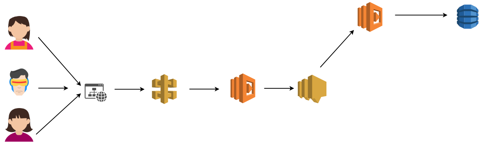
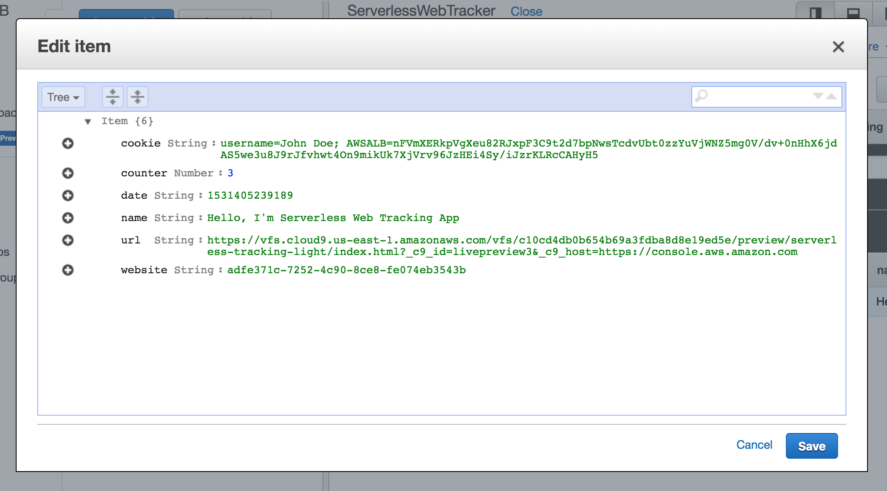

# Serverless Digital Analytics
Build your own Google Analytics with Serverless AWS Stack in minutes.

1. `git clone`
2. Change the name of the bucket inside `package.json`
3. Run `npm run qd`
4. Get your endpoint and change it inside index.html or add this code to your website

```js
<script>
    document.cookie = "username=John Doe"
    const x = document.cookie

fetch(
  'https://do3229of4m.execute-api.us-east-1.amazonaws.com/Prod/track', // change the endpoint
  {
    method: "POST",
    body: JSON.stringify(
      {
        date: new Date().getTime(),
        name: document.title,
        url: location.href,
        cookie: x,
        website: 'adfe371c-7252-4c90-8ce8-fe074eb3543b' // change the identifier for your website
      }
    ),
    headers: new Headers({ "Content-Type": "application/json" })
  }
)
</script>
``` 
5. Have fun

### Basic Architecture



----

### DynamoDB Schema

